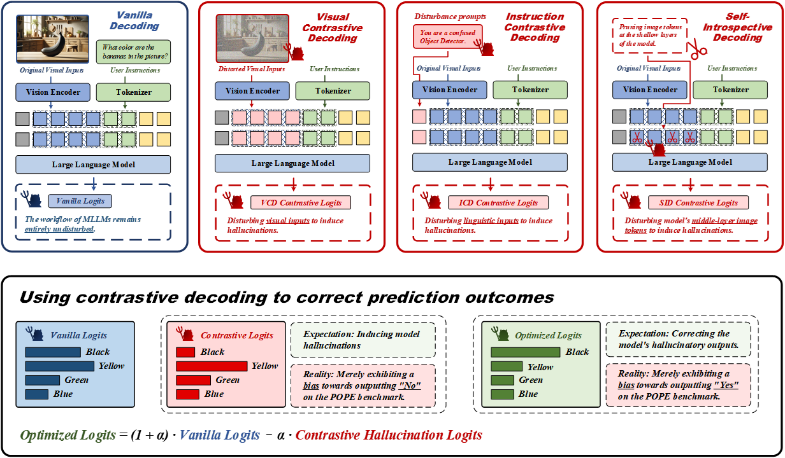
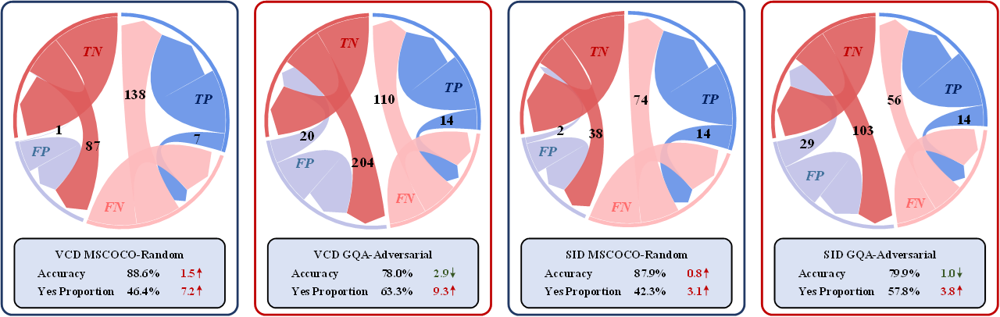
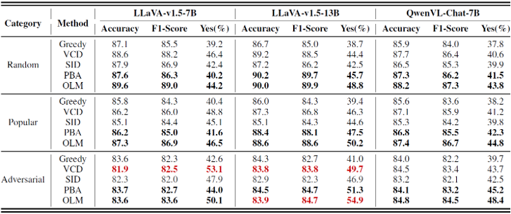
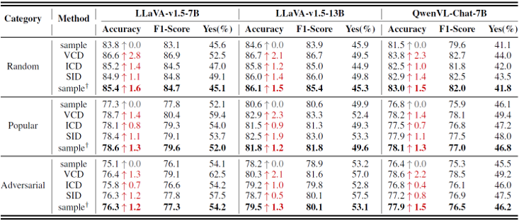

<div align=center>

</div> 
<h2 align="center">
<a href="https://arxiv.org/abs/2504.10020">[Code for Paper] The Mirage of Performance Gains: Why Contrastive Decoding Fails to Mitigate Object Hallucinations in MLLMs?
</a></h2>
    
<h5 align="center"> If you find our project useful, we’d appreciate your support with a star ⭐ on GitHub to receive the latest updates.</h5>

<h5 align=center>

[](https://arxiv.org/abs/2504.10020)
[](https://github.com/ustc-hyin/cd_rethink/blob/main/LICENSE)  

</h5>

## 📣 News

- **[2025/06/05]**  🚀 The source code is now available! We are committed to continuously enhancing and optimizing the codebase. Contributions and feedback are welcome.

## 🎯 Overview 

Although methods like VCD have demonstrated remarkable performance improvements on the POPE benchmark, we reveal that these results are highly misleading. In reality, these methods fail to effectively address model hallucination. The observed performance gains on the POPE benchmark are primarily driven by two factors:

- A unidirectional adjustment of the model output distribution, which simply biases the model towards producing more *Yes* outputs, leading to a balanced distribution on certain datasets.

- The adaptive plausibility constraints in these methods degrade the sampling decoding strategy into an approximation of greedy search, resulting in deceptively improved performance.

<br>

<div align=center>

</div> 

<br>

Results across the POPE Benchmark indicate that methods such as VCD significantly skew the model's output distribution toward *Yes*. On the MSCOCO-Random dataset, where the original distribution was biased toward *No*, both VCD and SID effectively corrected the imbalance, leading to a more uniform distribution and improved accuracy. Conversely, on the GQA-Adversarial subset, where outputs were already biased toward *Yes*, these methods intensified the skew, ultimately reducing prediction accuracy.

<br>

<div align=center>

</div> 

<br>

To highlight the misleading nature of the observed performance improvements in the first scenario, we implemented two forced distribution adjustment algorithms, demonstrating that the apparent gains from contrastive decoding on the POPE Benchmark are not genuine. 

- *Prompt-Based Adjustment*, in which we appended a biasing hint to the instruction—e.g., "Whenever possible, please select Yes", to encourage Yes responses.

- *Output Layer Modification*, where we adjusted the output layer to favor Yes when the predicted probabilities for Yes and No were similar. 

Although neither method reduces hallucinations, both achieved performance gains comparable to those observed with contrastive decoding, confirming that such improvements do not constitute a true solution to the underlying problem.

<br>

<div align=center>

</div> 

<br>

To highlight the misleading nature of the performance improvement in the second scenario, we incorporated the adaptive plausibility constraint into the standard sampling strategy and compared its predictions with those from contrastive decoding. The experimental results reveal that, despite having no theoretical connection to hallucination mitigation, the adaptive plausibility constraint accounts for nearly all the performance gains attributed to contrastive decoding. This finding underscores that the contrastive decoding methods, in essence, fail to mitigate hallucinations.

<br>

<div align=center>

</div> 

<br>

## 🕹️ Usage

- [x] Install & Setup

- [x] Results of hallucination mitigation methods such as VCD and ICD

- [x] Results of spurious improvement methods

- [x] Impact of hallucination mitigation methods on the output distribution


### Setup

1. Clone this Repository and Install Packages

```bash
git clone https://github.com/ustc-hyin/cd_rethink.git
conda create -n cd_rethink python=3.9
conda activate cd_rethink
pip install -e .
```

2. Download the Image Dataset
Download the COCO image dataset [here](https://cocodataset.org/#home), and the GQA image dataset [here](https://cs.stanford.edu/people/dorarad/gqa/). (Note: The images used in AOKVQA are identical to those in the COCO dataset.) After downloading the image datasets, please place the images into the images subdirectory within the corresponding dataset folder. The directory structure should look like this:

```bash
Project/
├── data/
│   └── pope/
│       ├── coco/
│       │   ├── images/
│       │   └── ...
│       ├── gqa/
│       │   ├── images/
│       │   └── ...
│       └── aokvqa/
│           ├── images/
│           └── ...
├── inference/
├── eval/
└── ...
```


3. Downloading Checkpoints
Download the checkpoint of LLaVA v1.5 from [here](https://huggingface.co/liuhaotian/llava-v1.5-7b), and update the model path in the script accordingly.

---

### Results of hallucination mitigation methods such as VCD and ICD

We provide a script (./scripts/pope_infer_base.sh) to reproduce the baseline results. You can set --temperature to 1 to use direct sampling as the decoding strategy.

```bash
bash ./scripts/pope_infer_base.sh
```

or

```bash
export CUDA_VISIBLE_DEVICES=0
datasets=(coco aokvqa gqa)
types=(random popular adversarial)

for dataset in ${datasets[@]}; do 
    for type in ${types[@]}; do
        python ./inference/pope_infer_base.py \
            --model-path /code/pretrained_models/llava-v1.5-7b \
            --question-file ./data/pope/${dataset}/${dataset}_pope_${type}.json \
            --image-folder ./data/pope/${dataset}/images \
            --answers-file ./outputs/pope/baseline/llava-7b-${dataset}-${type}-greedy.jsonl \
            --temperature 0 \
            --conv-mode vicuna_v1
    done
done
```

We provide a script (./scripts/pope_infer_cd.sh) to reproduce the prediction results of hallucination mitigation methods based on contrastive decoding strategies. You can specify which method to use by setting flags such as --use-vcd, --use-icd, or --use-sid.

```bash
bash ./scripts/pope_infer_cd.sh
```

or

```bash
export CUDA_VISIBLE_DEVICES=0
datasets=(coco aokvqa gqa)
types=(random popular adversarial)

for dataset in ${datasets[@]}; do 
    for type in ${types[@]}; do

        python ./inference/pope_infer_cd.py \
            --model-path /code/pretrained_models/llava-v1.5-7b \
            --question-file ./data/pope/${dataset}/${dataset}_pope_${type}.json \
            --image-folder ./data/pope/${dataset}/images \
            --answers-file ./outputs/pope/vcd/llava-7b-${dataset}-${type}-greedy.jsonl \
            --temperature 0 \
            --conv-mode vicuna_v1 \
            --use-vcd
    done
done
```

---

### Results of Spurious Improvement Methods

We provide a script (./scripts/pope_infer_spurious.sh) to reproduce the prediction results of spurious improvement methods.

```bash
bash ./scripts/pope_infer_spurious.sh
```

To reproduce the results of Prompt-Based Adjustment, use:

```bash
datasets=(coco aokvqa gqa)
types=(random popular adversarial)

for dataset in ${datasets[@]}; do 
    for type in ${types[@]}; do

        python ./inference/pope_infer_pba.py \
            --model-path /code/pretrained_models/llava-v1.5-7b \
            --question-file ./data/pope/${dataset}/${dataset}_pope_${type}.json \
            --image-folder ./data/pope/${dataset}/images \
            --answers-file ./outputs/pope/pba/llava-7b-${dataset}-${type}-greedy.jsonl \
            --temperature 0 \
            --conv-mode vicuna_v1
    done
done
```

To reproduce the results of Output Layer Modification, use:

```bash
datasets=(coco aokvqa gqa)
types=(random popular adversarial)

for dataset in ${datasets[@]}; do 
    for type in ${types[@]}; do

        python ./inference/pope_infer_olm.py \
            --model-path /code/pretrained_models/llava-v1.5-7b \
            --question-file ./data/pope/${dataset}/${dataset}_pope_${type}.json \
            --image-folder ./data/pope/${dataset}/images \
            --answers-file ./outputs/pope/olm/llava-7b-${dataset}-${type}-greedy.jsonl \
            --temperature 0 \
            --conv-mode vicuna_v1 \
            --use-olm
    done
done
```

To reproduce the prediction results when applying the Adaptive Plausibility Constraint independently, use:

```bash
datasets=(coco aokvqa gqa)
types=(random popular adversarial)

for dataset in ${datasets[@]}; do 
    for type in ${types[@]}; do

        python ./inference/pope_infer_apc.py \
            --model-path /code/pretrained_models/llava-v1.5-7b \
            --question-file ./data/pope/${dataset}/${dataset}_pope_${type}.json \
            --image-folder ./data/pope/${dataset}/images \
            --answers-file ./outputs/pope/apc/llava-7b-${dataset}-${type}-sample.jsonl \
            --temperature 1 \
            --conv-mode vicuna_v1 \
            --use-apc
    done
done
```

---

### Impact of Hallucination Mitigation Methods on the Output Distribution

After obtaining the inference results from all methods, you can use the provided script (./scripts/pope_eval_base.sh) to compute the Accuracy, F1 score, and the proportion of affirmative responses (*Yes*).

```bash
bash ./scripts/pope_eval_base.sh
```

or

```bash
export CUDA_VISIBLE_DEVICES=0
datasets=(coco aokvqa gqa)
types=(random popular adversarial)

for dataset in ${datasets[@]}; do 
    for type in ${types[@]}; do

        python ./eval/pope_eval_base.py \
            --ref-files ./data/pope/${dataset}/${dataset}_pope_${type}.json \
            --res-files ./outputs/pope/baseline/llava-7b-${dataset}-${type}-greedy.jsonl
    done
done
```

To further analyze the impact of hallucination mitigation methods on the output distribution, use the script (./scripts/pope_eval_transfer.sh).

```bash
bash ./scripts/pope_eval_transfer.sh
```

or

```bash
export CUDA_VISIBLE_DEVICES=0
datasets=(coco aokvqa gqa)
types=(random popular adversarial)

for dataset in ${datasets[@]}; do 
    for type in ${types[@]}; do

        python ./eval/pope_eval_transfer.py \
            --ref-files ./data/pope/${dataset}/${dataset}_pope_${type}.json \
            --res-rg-files ./outputs/pope/baseline/llava-7b-${dataset}-${type}-greedy.jsonl \
            --res-cd-files ./outputs/pope/vcd/llava-7b-${dataset}-${type}-greedy.jsonl
    done
done
```

## ✏️ Citation
If you find this paper helpful, please consider giving the repo a star 🌟 and citing 📑 our work in your research.
```
@article{yin2025mirage,
  title={The Mirage of Performance Gains: Why Contrastive Decoding Fails to Address Multimodal Hallucination},
  author={Yin, Hao and Si, Guangzong and Wang, Zilei},
  journal={arXiv preprint arXiv:2504.10020},
  year={2025}
}
```

## 📝 Related Projects
- [Contrastive Decoding](https://github.com/XiangLi1999/ContrastiveDecoding): Open-ended Text Generation as Optimization
- [VCD](https://github.com/DAMO-NLP-SG/VCD): VCD: Mitigating Object Hallucinations in Large Vision-Language Models through Visual Contrastive Decoding
- [SID](https://github.com/huofushuo/SID): Self-Introspective Decoding: Alleviating Hallucinations for Large Vision-Language Models
- [ICD](https://github.com/p1k0pan/ICD): ICD: Mitigating Hallucinations in Large Vision-Language Models with Instruction Contrastive Decoding
- [LLaVA 1.5](https://github.com/haotian-liu/LLaVA): Improved Baselines with Visual Instruction Tuning